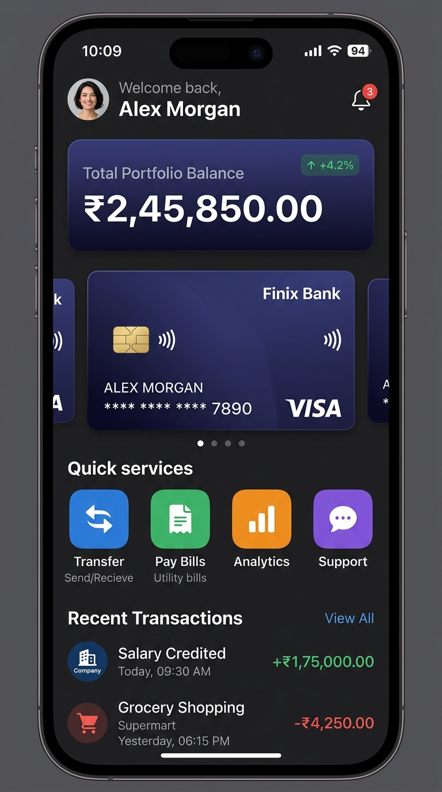
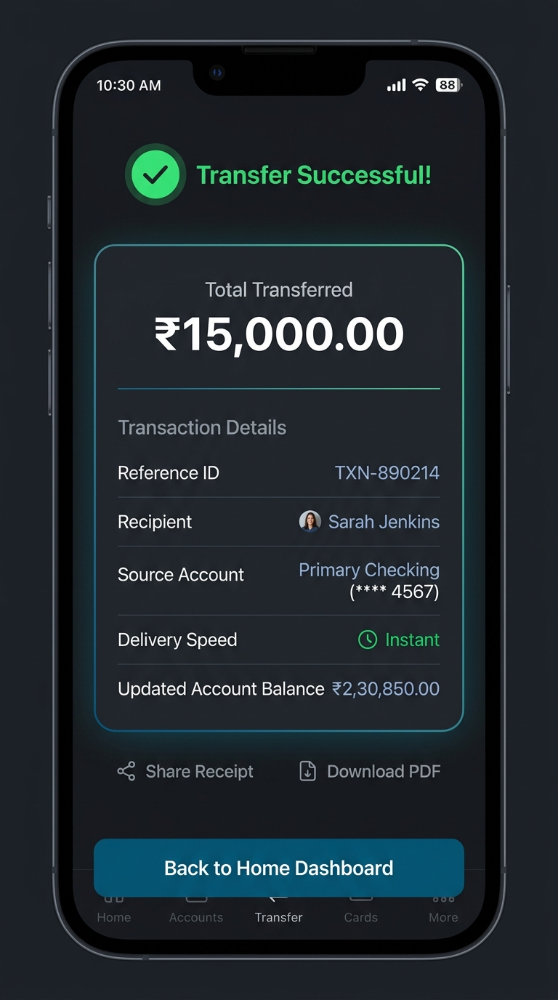

# 🏦 Personal Banking Mobile Application

A modern, full-featured Personal Banking mobile application built with **Flutter** and **Material 3**. Designed with clean architecture, dynamic state updates, rich visual aesthetics, custom light & dark themes, and comprehensive financial tools.

---

## 📸 App Preview & Screenshots

<div align="center">
  
  
</div>


---

## ✨ Key Features

- 📊 **Home Dashboard**: Total portfolio net balance calculator (`fold()`), portfolio growth trend (+4.2%), profile greeting, and real-time unread notification badge.
- 💳 **Accounts & Cards Carousel**: Interactive debit/credit card carousel featuring gradient backgrounds, card type badges, EMV chip icons, and contactless symbols.
- ⚡ **Quick Services Grid**: 4-column service shortcuts for Transfers, Bill Payments, Analytics, and Customer Support.
- 💸 **Send Money Transfers**: Source account selection, recipient details validation, transfer category selection, delivery speed options (*Standard Free* vs *Instant +₹150 fee*), and interactive `AlertDialog` confirmation.
- 🧾 **Digital Transfer Receipts**: Detailed post-payment summary displaying reference ID, timestamp, breakdown, and updated account balance.
- 📄 **Pay Utility Bills**: Utility biller selector (Electricity, Water, Mobile, Internet, Gas, DTH) with consumer ID input and balance check.
- 📈 **Spending Analytics**: Income vs Expense breakdown cards, net monthly savings indicator (green savings vs red warning), and category progress bars.
- 🔍 **Activity Search & Filter**: Real-time transaction history search by title, category, or recipient, with category choice chips (`All`, `Credit`, `Debit`).
- 🌗 **Light & Dark Theme Support**: Built-in `AppTheme` with custom color schemes, navy/indigo accents, and instant dark mode switch.

---

## 🛠 Tech Stack & Architecture

* **Framework**: Flutter 3.x (Dart 3.x)
* **Design System**: Material 3, Custom HSL / RGB color tokens, Google Inter-style typography
* **State Management**: Reactive state lifting (`main.dart` root dynamic state)
* **Data Flow**: Unidirectional data flow with callback handlers (`onTransferCompleted`, `onThemeChanged`)

```
lib/
├── data/              # Mock dataset repository (dummy_data.dart)
├── models/            # Domain entities (account, transaction, notification)
├── screens/           # 8 feature screens & sub-views
├── theme/             # Light & Dark Material 3 theme rules (app_theme.dart)
├── widgets/           # 4 reusable modular UI components
└── main.dart          # Entry point & root dynamic state container
```

---

## 🚀 Getting Started

### Prerequisites
- Flutter SDK `^3.13.2` or newer
- Dart SDK `^3.13.2`
- Android Studio / VS Code with Flutter extension

### Installation & Execution

1. **Clone or open project directory**:
   ```bash
   cd personal_banking_app
   ```

2. **Install Flutter dependencies**:
   ```bash
   flutter pub get
   ```

3. **Run on connected Mobile device or Emulator**:
   ```bash
   flutter run
   ```

4. **Run on Web**:
   ```bash
   flutter run -d chrome
   ```

---
